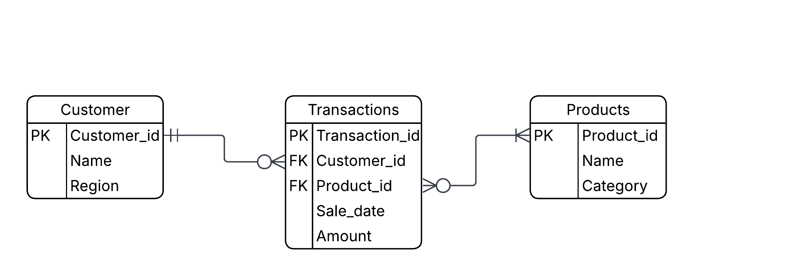
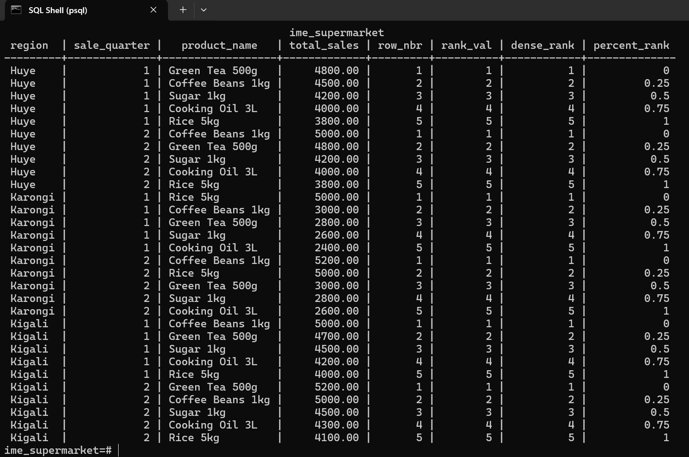

#PL/SQL window functions project
**Names: **INEZA MUSEKURA Esperance
**Student_Id: ** 28777
**Course: **Database development with PL/SQL
**Instructor: **Eric Maniraguha

## 1. Problem definition
**Business context: **IME supermarket(Retail, Sales and Marketing Department)
**Data challenge: **
My company is trying to find the products which are highly sold within specified period in different regions and also to understand the customers’ spending patterns and product sales trends
**Expected outcome: **
Our company will use SQL window functions to get:
A ranked list of top 5 best selling products in different regions and quarter
Running monthly sales totals per region and quarter
Month-Over-Month growth patterns
Customers’ spending trends for targeted promotions
3-months moving averages
---
## 2. Success criteria
IME_supermarket will focus on 5 main measurable goals:
1.**Top 5 best selling products per region/quarter** using ranking functions(ROW_NUMBER(), RANK(), DENSE_RANK(), PERCENT_RANK() )
2. **Running monthly total sales** using aggregate functions: SUM(), AVG(), MIN(), MAX()
3. **Month-Over-Month Growth trends using navigation functions: LAG(), LEAD()
4. **Customer spending patterns** using distribution functions: NTILE(4), CUME_DIST()
5. **3 months moving averages** using navigation and aggregate functions
---
## 3. Database Schema
I have created 3 tables with relationships:
-**Customer:** customer_id, name, region.  
-**Products:** product_id, product_name, category
-**Transactions:** transaction_id, customer_id, product_id, sales_date, amount
**Sample functions:**
 
**ER Diagram:**

---
## 4. Window functions interpretation
### 4.1. Top 5 products per region/quarter
-Query file:

-Screenshot:

-**Interpretation:** This rank shows the top 5 best selling products in each of 3 regions: Kigali, Karongi and Huye ordered by decreasing amounts of total sales.
---

 ### 4.2. Running monthly sales total
-Query file:

-Sreenshot:

-**Interpretation:** This makes the sum of sales in each month up to the last month and also displays minimum and maximum monthly sales.
---

-Query file

-Sceenshot:

-**Interpretation:** This makes comparison between current month and previous month. Some months shows growth and others decline
---

### 4.4 Customer spending patterns
-Query File

-Screenshot:

-**Interpretation:** This shows how different customers spend by dividing them into 4 categories where the top spenders are in quartile 1 and the least in fourth quartile.
---

### 4.5 3 months moving averages
-Query file:

-Screnshot:

-**Interpretation:**This shows the average sales of 3 months in a certain quarter ,also shows some highs and lows in monthly sales and later make the overall average.
---

## 5. Results analysis
**Descriptive(What happened)**We have seen that among three regions, the top 5 selling products are:Green tea, Coffee beans, sugar, cooking oil and rice. Also for some months, sales amount rises and for the rest they go down.Furthermore, the customers are divided into 4 segments where some of them spend a little bit more than others.

**Diagnostic(Why)** These trends may depend on customers preferences and also the region they are settled because from observation, the different regions have different top products, so this might be one of the factors. Also there are some months, where most customers are not financially stable due to their living conditions in each region and at the same time there is lack of promotions and this leads to decline of my business.

**Prescriptive(What next)** I am going to increase stock of greentea, coffee beans, sugar, cooking oil and rice more than other products in each region but also considering the best preference of each region. Also during weak months , I will try to give promotions to my clients like discounts, providing gifts and free goods and I will encourage least spenders by giving them discounts and rewarding top spenders to encourage them to stay.
---

## 6. References

1.https://www.datacamp.com/cheat-sheet/sql-window-functions-cheat-sheet
2.W3schools/My SQL: https://www.w3schools.com/mysql
3.https://learnsql.com/blog/lead-and-lag-functions-in-sql/
4.Tutorial about creating readme profile: https://www.youtube.com/watch?v=rCt9DatF63I&t=338s
5.Tutorial about window functions: https://www.youtube.com/watch?v=Ww71knvhQ-s
6.https://docs.data.world/documentation/sql/reference/aggregations/
7.Postgresql documentation: https://www.postgresql.org/docs/18/tutorial-window.html
8.SQL window functions tutorial: https://www.youtube.com/watch?v=rIcB4zMYMas
9.GeeksforGeeks SQL Window Functions : https://www.geeksforgeeks.org/sql/window-functions-in-sql/
10.Mode analytics: http://mode.com/sql-tutorial/sql-window-functions
11.Tutorial about creating readme file: https://www.youtube.com/watch?v=HKdhiOp2uVA
---

“All sources were properly cited. Implementations and analysis represent original work. No AI generated content was copied without attribution or adaptation.
